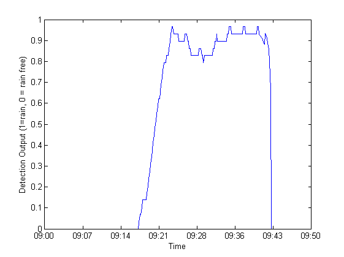

# RainNoiseDetection
Algorithm for automatically detecting Outdoor Rain-fall noise in soundscapes - intended for data-filtering in bio-acoustics, but may have other uses.

This function is free to use and modify, if you do use it in could you kindly provide an acknowledgement in the form of a citation:

Paul Kendrick - TBC

This algorithm is designed to detect rain-fall noise in 10 s chunks, the resulting detection is then averaged over 5 minute periods.  The function is written in Matlab and the usage is as follows;

## Installation
After cloning or downloading the git repro, run the matlab script 'install.m' from the directory containing the rain-detector which will add the required paths.

##Usage
An example of the usage is presented in TestRainDet.m, if you run this script it will process the data from two example files of outdoor recordings, where initially there is no rain and then rain starts about 15 minutes into the recording, the recording consists of two wav files, which represent a contiguous recording.  The main function is contained in the script acousticRainDetection.m, the output of the function is as follows where the rain is detected as a value between 0 and 1, where 1 is certain rainfall and 0 is certain rain free.

the usage of this function is as follows:

The function assumes mono audio, and a sampling frequency of 44.1 kHz.Although it will accept any sampling frequency, and resample to 44.1 kHz. Stereo files are summed over the channels to mono.
 **fileNameCells** is a cell array where each cell contains a string where the
   string is the path and filename of a wav file, the order of the files
   important, this enables processing of recordings consisting of multiple
   files,  
 **startdate** is a number in matlab datenum format represents the
   exact start time of the first recording, the files must be contiguous.
    
 The function description: 
 1) Audio is analysed in 10 sec, non overlapping chunks
 2) In each 10s chunk a selection of audio features are extracted
 3) from these features  Random forest has been trained to detect the presence of rain fall, the random forest was trained using the statistics toolbox, but a function has been provided to evaluate the forest without the toolbox (randForest)
 4) the function will output the class of each 10 s chunk (0= rain free, 1= contains rain), which has been smoothed using a 5minute moving average window (30 10s chunks)
 5) the function utilises the parallel computing tool box if available and will automatically process Nc process simultaneously where Nc is the number of cores on the computer, the function extracts a numnber of wav files at each iteration so that the data is separately available for each core in the parfor loop.

The output of function consists of the smoothed rainfall detection over the measurement period, the raw detected output, and a vector (in matlab datenum format) of times.

This function utilises the WMTSA Wavelet Toolkit for MATLAB http://www.atmos.washington.edu/~wmtsa/, and the interfacing function 'getmsawpfeat http://uk.mathworks.com/matlabcentral/fileexchange/33146-feature-extraction-using-multisignal-wavelet-packet-decomposition 
Both are included in this repro as is permitted under the FreeBSD License.
